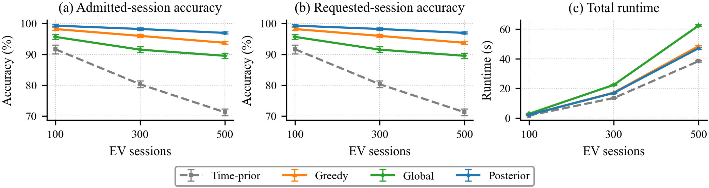

# Posterior-Aware Online Matching of EV–Charger Pairs under Delayed Anonymous Telemetry

This repository contains the official implementation of the paper:

> **Posterior-Aware Online Matching of EV–Charger Pairs under Delayed Anonymous Telemetry**  
> *Authors: Jiseok Yang, Daisuke Kodaira*  
> *Submitted to IEEE Access*

<p align="center">
  
</p>

The proposed two-stage posterior matcher (A3, blue) retains the highest identification accuracy for both admitted and requested sessions as the session load scales from 100 to 500, while the time-prior baseline degrades under larger candidate ambiguity; its total runtime stays comparable to the greedy waveform baseline. This accuracy advantage under identical decision timing — measured at the representative operating point over 20 paired repeats — is the central result of the paper (Figure 3 / Table 6).

---

## ⚡ Quick Reproduction

The committed aggregate result tables already support every headline number in the paper, so the published claims can be checked in **seconds** — no long simulation is required.

```bash
# 1. Clone & install (~2 min)
git clone https://github.com/SmartGridLab/Posterior-Aware-Online-Matching-of-EV-Charger-Pairs-under-Delayed-Anonymous-Telemetry.git
cd Posterior-Aware-Online-Matching-of-EV-Charger-Pairs-under-Delayed-Anonymous-Telemetry
python3.10 -m venv .venv && source .venv/bin/activate
pip install -r requirements.txt

# 2. Verify the published claims against the committed result tables (seconds)
python scripts/reproduce_all.py --mode verify-existing
python -m pytest

# 3. Regenerate manuscript Figures 3–6 from the committed CSVs (seconds, no resimulation)
python scripts/reproduce_all.py --mode figures
```

**Expected outputs**

| Output | Paper artefact |
|---|---|
| `verify-existing` prints a claim-check JSON with all checks `"ok": true` | Table 6 + Section VI numbers |
| `paper/figure3_base_load_comparison.pdf` (3-panel) | **Figure 3** (Section VI-A) |
| `paper/figure4_sampling_sensitivity.pdf` | **Figure 4** (Section VI-B) |
| `paper/figure5_posterior_diagnostic.pdf` (measured posterior trace from the canonical replay; data in `case_study/scalability_analysis/accuracy/figure5_posterior_trace.csv`, regenerated by `scripts/extract_figure5_posterior_trace.py`, seed 2187632432) | **Figure 5** (Section VI-C) |
| `paper/figure6_ablation_summary.pdf` (3-panel) | **Figure 6** (Section VI-C) |
| `case_study/scalability_analysis/accuracy/canonical_run_20260626_170431_105970/{summary.csv, raw_runs.csv, report.json}` | numerical baselines (match Table 6 at the operating point) |

**Approximate wall-clock** (single-threaded, recent laptop; hardware-dependent):

| Step | Time |
|---|---|
| `--mode verify-existing` (claim check from committed CSV) | seconds |
| `--mode figures` (rebuild Figures 3–6 from committed CSV) | seconds |
| `--mode smoke` (small deterministic simulation) | ≈ 1 min |
| `--mode ablation` (Section VI-C / Figure 6 ablation variants, 12 × 60 runs) | a few hours (the `EV = 500` cells dominate) |
| `--mode full` (the 6480-run Section VI sweep) | several hours (the `EV = 500`, `Δt_EV = 5 s` cells dominate) |

---

## 📝 Abstract

Alternating-current charging under the International Electrotechnical Commission (IEC) 61851-1 standard prohibits identity exchange between an electric vehicle (EV) and its charger, blocking pair-level identification. Modulated Charging Current Technology (MCCT) recovers identity from the charging waveform, but prior formulations assume that all evidence is available at decision time — an assumption violated when the vehicle-side stream arrives only through delayed anonymous cloud telemetry.

This paper formulates identification as a sequential online decision under asymmetric observability and proposes a two-stage Bayesian posterior matcher (A3) that integrates timing and current-response evidence through sequential posterior updates within each watermark decision. Evaluated against three single-shot baselines (A0 time-prior, A1 greedy waveform, A2 global waveform) on a shared event-driven runtime, the proposed matcher achieves higher identification accuracy under a common decision-latency envelope, with the advantage preserved across sampling-interval, watermark, and candidate-margin sweeps.

---

## 📂 Repository Structure

The folder layout follows the same responsibility split used by the predecessor SmartGridLab MCCT
reference repository (current generation → pair identification → case study → result artifacts).

```text
.
├── charging_current_generation/    # [Section V-A] MCCT command pattern → EVSE charger current
│   └── command_charger_current.py  #   command-to-current response model (predecessor model; see Acknowledgements)
│
├── pair_identification/            # [Sections III–IV] online runtime, costs, and posterior updates
│   ├── contracts.py                #   [§III]   runtime type contracts (sessions, slots, costs, config)
│   ├── runtime_event_loop.py       #   [§IV-A]  shared event-driven runtime (5 s evaluation tick)
│   ├── runtime_candidates.py       #   [§III-C] candidate gating (Eq. 4)
│   ├── runtime_assignment.py       #   [§IV-B]  A0 / A1 / A2 cost-matrix builders + Hungarian
│   ├── runtime_bayesian.py         #   [§IV-B]  A3 two-stage posterior matcher (Eq. 13–17)
│   ├── matching_core.py            #   waveform costs (DTW + step signature), site construction
│   └── ingestion_reference.py      #   cloud-ingestion baseline anchored to public sources
│                                   #   (RFC 6455 / RFC 6298 / FCC MBA / OCPP defaults)
│
├── case_study/                     # [Section VI] results and reproduction drivers
│   ├── section_vi_reproduction.py  #   paired-repeat comparison harness (Section VI driver)
│   ├── site_simulation.py          #   [§V] scenario / EV arrivals / 50-slot EVSE site
│   ├── diagnostic_ev_logs.py       #   diagnostic per-EV log helper
│   ├── diagnostic_terminal_logs.py #   console/terminal log helper
│   └── scalability_analysis/
│       └── accuracy/
│           ├── canonical_run_20260626_170431_105970/   # canonical submitted data (main grid)
│           │   ├── summary.csv      #   aggregate mean / std / 95 % CI per operating point
│           │   ├── raw_runs.csv     #   per-(algorithm, repeat, operating point) metrics
│           │   ├── report.json      #   structured run manifest (seed, config, grid)
│           │   ├── config.json, resolved_runtime_config.json, physical_model_manifest.json
│           │   └── git_revision.txt
│           ├── ablation_run_20260703_185002_516173/    # Section VI-C ablation run (Figure 6)
│           │   └── (same file layout as the canonical run)
│           ├── figure6_ablation_simulated.csv          # Figure 6 data table (from the ablation run)
│           └── README.md
│
├── scripts/                        # public command-line entry points
│   ├── reproduce_all.py            #   verify-existing / figures / smoke / ablation / full driver
│   ├── generate_paper_figure3_base_load_comparison.py
│   ├── generate_paper_figure4_sampling_sensitivity.py
│   ├── generate_paper_figure5_posterior_diagnostic.py
│   ├── generate_paper_figure6_ablation_summary.py
│   ├── manuscript_figure_generation.py   # shared Figure 3–6 implementation (Times New Roman + STIX)
│   ├── build_figure6_data.py       #   ablation run summary → figure6_ablation_simulated.csv
│   └── validate_replay_consistency.py
│
├── tests/                          # claim-check and reproducibility unit tests
│   ├── test_summary_claims.py
│   └── test_causal_reindex.py
│
├── paper/
│   ├── Posterior-Aware_Online_Matching_of_EV-Charger_Pairs_under_Delayed_Anonymous_Telemetry.pdf   # manuscript (12 pages)
│   ├── Posterior-Aware_..._source.tex    # LaTeX source
│   ├── figure1_two_plane_observability.pdf … figure6_ablation_summary.pdf   # Figure 1–6 assets
│   └── ieeeaccess.cls, *.sty, fonts      # IEEE Access template assets
│
├── docs/
│   ├── PAPER_CODE_MAP.md           # paper item ↔ code ↔ evidence-artifact map
│   ├── MANUSCRIPT_FIGURE_GENERATION.md
│   └── preview/                    # README preview image
│
├── .devcontainer/devcontainer.json # VS Code / Codespaces dev-container definition
├── .github/workflows/ci.yml        # CI: compile + verify-existing + pytest
├── LICENSE
├── CITATION.cff
├── requirements.txt
└── .gitignore
```

> New simulation outputs are written under `.generated/` (Git-ignored). The committed
> `case_study/scalability_analysis/accuracy/` directory intentionally contains only the
> canonical numerical data used by the submitted manuscript.

---

## 💻 Installation

### 1. Prerequisites

* Python **3.10** (or higher). The pipeline is also tested on Python 3.11 and 3.13.

#### Option A: Manual Installation (Local Environment)

```bash
git clone https://github.com/SmartGridLab/Posterior-Aware-Online-Matching-of-EV-Charger-Pairs-under-Delayed-Anonymous-Telemetry.git
cd Posterior-Aware-Online-Matching-of-EV-Charger-Pairs-under-Delayed-Anonymous-Telemetry

# Using venv
python3.10 -m venv .venv
source .venv/bin/activate          # On Windows: .venv\Scripts\activate

# OR using Conda
conda create -n ev-posterior python=3.10
conda activate ev-posterior

pip install -r requirements.txt
```

#### Option B: Development Container (VS Code + Docker)

The repository ships a `.devcontainer/devcontainer.json` so the environment can be
reproduced without touching the local system:

1. In VS Code, open the **Command Palette** (`Shift`+`Cmd`+`P` on macOS, `Ctrl`+`Shift`+`P` on Windows/Linux).
2. Select **"Dev Containers: Clone Repository in Container Volume..."** and paste the repository URL.
3. VS Code builds a `python:3.10-bullseye` container and installs `requirements.txt` automatically.

### 2. Execution Environment

The reference numerical results were produced under the following environment.

| Item | Value |
|---|---|
| OS (tested) | macOS 14 (Darwin 23+), Ubuntu 22.04 LTS, Windows 11 (WSL2) |
| Python | 3.10 (also tested on 3.11 / 3.13) |
| Architecture | x86\_64 / arm64 (Apple Silicon) |
| RAM | ≥ 8 GB recommended |
| GPU | not required |

### 3. Dependencies

All Python package dependencies are pinned (lower-bound) in [`requirements.txt`](requirements.txt):

```text
numpy>=1.23
pandas>=1.5
scipy>=1.10
matplotlib>=3.7
Pillow>=9.5
pytest>=7.0
```

To render the manuscript figures in genuine **Times New Roman**, run the figure scripts on a
machine where that font is installed (e.g. macOS). On systems without it, matplotlib falls back
to the metric-compatible Liberation Serif / Nimbus Roman, and the figures are visually identical.

---

## 🚀 Usage

All commands are run from the **repository root**. The single entry point is
`scripts/reproduce_all.py`, which has five modes.

### Seeds

Every Section VI result is keyed off a single base seed, `2187631072`, exposed as
`--base-seed` (default). Per-repeat seeds are `base_seed + repeat_index`, and the same
`repeat_index` is replayed across all four matchers, so any cross-matcher accuracy gap is
attributable to algorithm design rather than scenario variance.

### 1. Verify the published claims (fast)

Checks that the committed canonical `summary.csv` supports the headline manuscript claims and
runs the unit tests. This is the recommended first step for reviewers.

```bash
python scripts/reproduce_all.py --mode verify-existing
python -m pytest
```

*Output:* a claim-check JSON on stdout (all entries `"ok": true`), e.g. A3 at the
representative 500-session point has `accuracy_mean = 0.9695` and all four matchers share
`p90_latency_mean = 416.035`.

### 2. Rebuild the manuscript figures (fast, no resimulation)

```bash
python scripts/reproduce_all.py --mode figures
```

This regenerates `paper/figure3_base_load_comparison.pdf` … `paper/figure6_ablation_summary.pdf`
directly from the committed CSV tables. The figures can also be rebuilt individually and
installed into `paper/`:

```bash
python scripts/generate_paper_figure3_base_load_comparison.py --install-paper
python scripts/generate_paper_figure4_sampling_sensitivity.py --install-paper
python scripts/generate_paper_figure5_posterior_diagnostic.py --install-paper
python scripts/generate_paper_figure6_ablation_summary.py --install-paper
```

### 3. Small deterministic smoke run

```bash
python scripts/reproduce_all.py --mode smoke
```

Runs a small simulation (`EV = 20`, 1 repeat) end-to-end and writes its outputs under
`.generated/` (Git-ignored). Useful to confirm the simulator executes on a new machine.

### 4. Ablation reproduction (Section VI-C, Figure 6)

```bash
python scripts/reproduce_all.py --mode ablation
```

Re-runs the 12 ablation variants of Section VI-C (the A1 / A2 / A3 families of
Figure 6) on the base-load grid (`EV ∈ {100, 300, 500}`, `Δt_EV = 30 s`,
`d_max = 10 s`, `Δ = 120 s`, 20 repeats; reported aggregates at `EV = 300` use the
held-out evaluation repeats 6–20 per the manuscript's TABLE 5 protocol). The default base seed (`2187632392`
= `2187631072 + 1320`, the canonical scenario seed of the first repeat in this
base-load block) replays exactly the same scenario realizations as the canonical
full sweep, so the full-design rows
(`single_only`, `nomura_original_interval_hungarian`, `bayesian_windowed`) must
reproduce the canonical `summary.csv` values. The committed run
`case_study/scalability_analysis/accuracy/ablation_run_20260703_185002_516173/`
is exactly such a run and is the numerical source of manuscript Figure 6
(tabulated by `scripts/build_figure6_data.py`, which also enforces the
full-row-equality gate). Re-running takes a few hours single-threaded; use
`--repeats 2` for a quick screen (means then differ from the 20-repeat figure).

> **Provenance note.** The committed archived runs were produced by an earlier
> code revision whose A3 matcher carried an optional confidence-lock stabilizer
> that was later shown to be output-neutral and removed from the method and the
> codebase before submission. The committed evidence run
> `case_study/scalability_analysis/accuracy/lock_equivalence_run_20260704_201609_736039/`
> replays the full 81-cell × 20-repeat canonical grid and proves per-run equality
> on every reported axis (`python scripts/verify_nolock_equivalence.py`, 0/1620
> mismatches everywhere), so the archived numbers are exactly the numbers of the
> submitted matcher. The archived ablation run therefore contains one retired
> variant id (`bayesian_windowed_lock_off`) that is no longer plotted.

### 5. Full Section VI reproduction

```bash
python scripts/reproduce_all.py --mode full
```

Reruns the complete Section VI grid (the canonical `2187631072`-seeded sweep):

- EV-session counts: `100, 300, 500`
- EVSE count: `50`
- repeats: `20`
- EV sampling periods: `5, 15, 30` s
- watermark delay bounds: `5, 10, 15` s
- candidate margins: `60, 120, 180` s
- algorithms: A0, A1, A2, A3

This is **6480 simulations** (324 operating points × 20 repeats) and takes several hours
single-threaded. Use `--trace-level full` only when detailed event/cost/posterior traces are
needed; `summary` (default) is enough to regenerate the manuscript tables and figures.

### Expected output (verified)

At the representative point `(EV = 500, Δt_EV = 30 s, d_max = 10 s, Δ = 120 s)`, the committed
`summary.csv` reproduces the paper's Table 6:

| Matcher | Paper Acc | `accuracy_mean` | Paper L90 | `p90_latency_mean` | Paper Runtime | `runtime_s_total_mean` |
|---|---|---|---|---|---|---|
| A0 (`time_only_baseline`) | 0.71 | 0.7121 | 416 | 416.035 | 38.4 | 38.405 |
| A1 (`single_only`) | 0.94 | 0.9374 | 416 | 416.035 | 48.5 | 48.547 |
| A2 (`nomura_original_interval_hungarian`) | 0.90 | 0.8952 | 416 | 416.035 | 62.5 | 62.457 |
| A3 (`bayesian_windowed`) | **0.97** | **0.9695** | 416 | 416.035 | 47.1 | 47.148 |

The full paper item ↔ code ↔ evidence-artifact map is in [`docs/PAPER_CODE_MAP.md`](docs/PAPER_CODE_MAP.md).

---

## 📊 Methodology

The proposed **two-stage posterior matcher (A3)** is one of four matchers compared on a shared
event-driven runtime, corresponding to **Section IV** of the manuscript.

1. **Shared event-driven runtime** (Section IV-A, `pair_identification/runtime_event_loop.py`):
   * **Window-watermark gating** — a session matures only after its watermark `t_{wm,i}` is reached (Eq. 2–3).
   * **Candidate gating** — at each decision tick the candidate set `C_i` is restricted by a temporal-margin window of width `Δ` (Eq. 4, `runtime_candidates.py`).
   * **Hungarian assignment** — a one-to-one assignment is computed over the gated candidate set (Eq. 5).

2. **Single-shot baselines** (Section IV-B, `pair_identification/runtime_assignment.py`):
   * **A0 — Time-prior**: timing-only cost.
   * **A1 — Greedy waveform**: `λ_dtw · d_DTW + λ_step · d_step`.
   * **A2 — Global waveform**: normalized correlation + DTW (the predecessor MCCT cost, generalized to the online runtime).

3. **Two-stage posterior matcher** (Section IV-B, proposed, `pair_identification/runtime_bayesian.py`):
   * **Posterior update** — two weighted stages per watermark decision combine the timing prior and the current likelihood with the carried-over belief (Eq. 13).
   * **Blended assignment cost** — the posterior log-cost is blended with the last stage's likelihood log-cost (Eq. 17) and passed to the shared Hungarian assignment.
   * **Hyperparameters** (`λ`, `α`, `β`, `γ`) are fixed on the calibration slice (`EV = 300`, repeats 1–5) and listed in Table 2 of the paper; all Section VI numbers come from the held-out evaluation slice.

### Algorithm ID ↔ Paper notation

| Paper ID | Description | Implementation |
|---|---|---|
| **A0** | Time-prior baseline (timing only) | `pair_identification/runtime_assignment.py` (timing-only branch) |
| **A1** | Greedy waveform matcher (DTW + step signature) | `pair_identification/runtime_assignment.py` (greedy branch) |
| **A2** | Global waveform assignment (correlation + DTW) | `pair_identification/runtime_assignment.py` (Hungarian + composite cost) |
| **A3** | **Two-stage posterior matcher** (proposed) | `pair_identification/runtime_bayesian.py` (two-stage posterior update) |

All four matchers share the same runtime (`runtime_event_loop.py`) and candidate gating
(`runtime_candidates.py`); they differ only in how the cost matrix is built.

---

## 📚 Citation

If you use this code in your research, please cite our paper:

```bibtex
@article{Yang2026PosteriorMCCT,
  title   = {Posterior-Aware Online Matching of EV--Charger Pairs under Delayed Anonymous Telemetry},
  author  = {Yang, Jiseok and Kodaira, Daisuke},
  journal = {IEEE Access},
  year    = {2026},
  note    = {Under review}
}
```

A machine-readable [`CITATION.cff`](CITATION.cff) is also provided.

---

## 🙏 Acknowledgements

The charging-current generation model in `charging_current_generation/command_charger_current.py`
reuses the command-to-current response model from the predecessor paper by Nomura *et al.*, whose
model was fitted on EV/EVSE current measurements obtained collaboratively with the U-Tokyo
(Imanaka) group and YourStand. MCCT was originally proposed by Baba and Imanaka and is cited as the
conceptual origin only; no raw data, protocol, or experimental setup from that work was reused here.

> H. Baba and M. Imanaka, "Report on basic experiments of normal charger-EV linking technology," in *Proc. IEEJ EIS Division Conf.*, Paper GS8-6, Aug. 2024.
>
> N. Nomura, H. Baba, M. Imanaka, and D. Kodaira, "Individual identification of multiple EV–charger pairs via modulated charging current technology," in *Proc. 14th ICRERA*, Vienna, Austria, Oct. 2025, pp. 246–251, doi: 10.1109/ICRERA66237.2025.11283721.

The raw Wallbox–Tesla measurement data from that collaboration is **not** redistributed in this
repository. All other components — the online runtime, two-stage posterior matcher, candidate gating,
watermark logic, cloud-ingestion baseline, and EV-side sensing-distortion model — are original to
the present authors. Public-domain references used in the cloud-ingestion baseline (IETF RFC 6455,
RFC 6298, the FCC Measuring Broadband America report, and published OCPP configuration defaults)
are enumerated in `pair_identification/ingestion_reference.py`.

---

## License

Released under the [MIT License](LICENSE) — Copyright (c) 2026 Jiseok Yang and Daisuke Kodaira.
